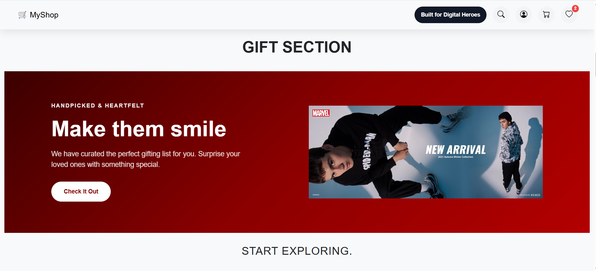

# Clothing E-Commerce Website



## About the Project

A full-stack clothing e-commerce website where users can browse products, view product details, manage wishlist items, add products to cart, and complete checkout after login. The project includes a React frontend with a Node.js and Express backend connected to MongoDB for user and cart data.

**Why I built this:** I built this project to practice full-stack development, authentication, cart management, and building a responsive shopping experience.

---

## Features

- [x] User authentication (Register / Login / Logout)
- [x] Product listing and product browsing
- [x] Product detail page
- [x] Add to cart / Remove from cart
- [x] Cart quantity update
- [x] Wishlist functionality
- [x] Protected checkout page
- [x] Responsive design (mobile + desktop)
- [ ] Admin panel

---

## Login Credentials

Use the following demo credentials for testing login:

```txt
Email: demo@example.com
Password: demo123
```

> If this user is not already available in your local MongoDB database, create it through the backend register API before logging in.

---

## Tech Stack

| Layer | Technology |
|---|---|
| Frontend | React.js + Vite |
| Backend | Node.js + Express.js |
| Database | MongoDB + Mongoose |
| Auth | JWT + bcryptjs |
| Routing | React Router DOM |
| Styling | CSS |
| Deployment | Vercel / Render / Railway |
| Version Control | GitHub |

---

## Project Structure

```txt
root/
|-- backend/                  # Express backend
|   |-- config/
|   |   `-- db.js
|   |-- middleware/
|   |   `-- authMiddleware.js
|   |-- models/
|   |   |-- cart.js
|   |   `-- user.js
|   |-- routes/
|   |   |-- authRoutes.js
|   |   `-- cartRoutes.js
|   `-- server.js
|-- public/
|-- src/                      # React frontend
|   |-- assets/
|   |-- components/
|   |-- context/
|   |-- hooks/
|   |-- pages/
|   |-- routes/
|   |-- App.jsx
|   `-- main.jsx
|-- index.html
|-- package.json
`-- README.md
```

---

## Getting Started (Local Setup)

```bash
# Clone the repo
git clone https://github.com/walhekarsoham/Clothing-Website.git

# Go to the project folder
cd Clothing-Website

# Install frontend dependencies
npm install

# Install backend dependencies
cd backend
npm install

# Set up environment variables
# Create a .env file inside the backend folder (see below)

# Run backend
npm run dev

# Run frontend in a new terminal
cd ..
npm run dev
```

---

## Environment Variables

Create a `.env` file in the `backend` folder with:

```env
MONGO_URI=
JWT_SECRET=
PORT=5000
```

---

## API Endpoints

| Method | Endpoint | Description |
|---|---|---|
| POST | `/api/auth/register` | Register a new user |
| POST | `/api/auth/login` | Login user and get token |
| GET | `/api/cart` | Get logged-in user's cart |
| POST | `/api/cart/add` | Add item to cart |
| POST | `/api/cart/update` | Update cart quantity |
| POST | `/api/cart/remove` | Remove item from cart |

---

## What I Learned

- Building a full-stack React and Express application with separate frontend and backend setup.
- Implementing JWT authentication and storing login state in the browser.
- Managing cart and wishlist state using React Context.
- Connecting Express routes with MongoDB models through Mongoose.

---

## Author

**Soham Walhekar**  
Email: walhekarsoham07@gmail.com  

---

## License

MIT
